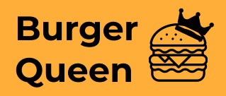
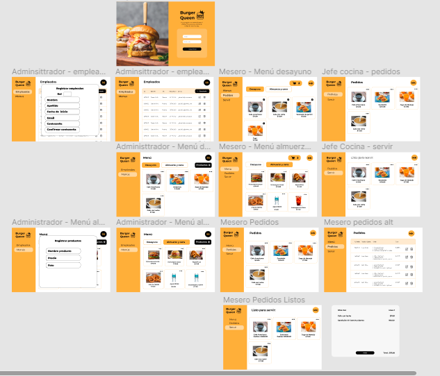

#

[Resumen del proyecto](#-getting-started) •
[UX Research](#installation) •
[Prototipado](#flowchart) •
[Interfaz gráfica final](#contributing) •
[Contact](#contact) •
[Acknowledgments](#acknowledgments)

# Resumen del proyecto

Este proyecto consiste en una interfaz a través de la cual un pequeño restaurante de hamburguesas puede tomar pedidos usando una tablet, y enviarlos a la cocina para que se preparen ordenada y eficientemente.

# UX Research

(<a href="#top">back to top</a>)

# Prototipado

Los protipos de alta fidelidad se realizarón en Figma, se pueden vizualizar en el siguiente [link](https://www.figma.com/file/9Lkk5oAp6M3n7qUvPnAPDb/Burger-Queen?node-id=0%3A1).

(<a href="#top">back to top</a>)

# Contact

> | Desarrolladoras  | LinkedIn                                                                                                                                                                              |
> | ---------------- | ------------------------------------------------------------------------------------------------------------------------------------------------------------------------------------- |
> | Margarita García |                |
> | Skarlet Araque   |                        |
> | Sarai Rojas      |  |

(<a href="#top">back to top</a>)

# Acknowledgments

- [Material Icons](https://github.com/alexandresanlim/Badges4-README.md-Profile)

(<a href="#top">back to top</a>)

